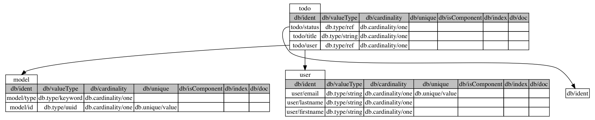

# datomap-plugin

 A plugin that provides some schema utilities and visualizations from the
 command line. Developing against virtual machines and containers is great
 for standardizing enviroments and developer throughput, however it can be
 difficult when you want to write to the local host's filesystem or utlize
 a windowing server to render a visualization. This plugin aims to provide the
 same functionality you would get from the datomap projec with regard to
 visualizing your datomic schema or dumping that schema to disk.

## Project Inclusion

You can add this plugin at the project or user level.  I personally have added
it to my user profile in `~/.lein/profiles.clj`

Use this for user-level plugins:

Put `[datomap-plugin "0.1.0-SNAPSHOT"]` into the `:plugins` vector of your `:user`
profile.

Use this for project-level plugins:

Put `[datomap-plugin "0.1.0-SNAPSHOT"]` into the `:plugins` vector of your project.clj.

 * `$ lein datomap :uri <datomic uri>`
  --renders graphiz table representation to screen
 *  `$ lein datomap :uri <datomic uri> :graph-type \"nodes\"`
  --renders graphiz directed graph where every attribute is a node
 * `$ lein datomap :uri <datomic uri> :op \"save-graph\" :file-out \"/path/to/file.png\"`
  --save graphiz tables of schema to file
 * `$ lein datomap :uri <datomic uri> :op \"dump-schema \" :file-out \"path/to/file.end>\"`
  --dumps edn file of schema attributes to :file-out"

## License

Copyright © 2017 FIXME

Distributed under the Eclipse Public License either version 1.0 or (at
your option) any later version.
